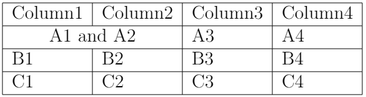
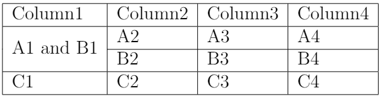
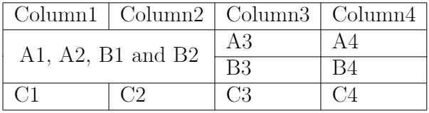

## 5.2 合并单元格

如果需要合并单元格，首先应在导言区声明`\usepackage{multirow}`以导入`multirow`宏包，并使用`\multicolumn`命令合并同行不同列的单元格、使用`\multirow`命令合并同列不同行的单元格。

### （1）合并不同列的单元格

合并不同列的单元格时，应在`tabular`环境中使用`\multicolumn{合并列数}{合并后的列类型参数}{单元格内容}`语句定义合并单元格。此时，合并后的单元格的列类型将由`\multicolumn`给出，而非`\begin{tabular}`中预设的列类型参数。

【**例5-4**】在`tabular`环境中使用`\multicolumn`命令合并不同列的单元格。

```tex
\documentclass[12pt]{article}
\usepackage{multirow}
\begin{document}

\begin{tabular}{|l|l|l|l|}
    \hline
    Column1 & Column2 & Column3 & Column4 \\
    \hline
    \multicolumn{2}{|c|}{A1 and A2} & A3 & A4 \\
    \hline
    B1 & B2 & B3 & B4 \\
    \hline
    C1 & C2 & C3 & C4 \\
    \hline
\end{tabular}

\end{document}
```

编译上述代码，得到表格如 图5.2.1 所示。

<p align="center">

</p>

<center><b>图5.2.1</b> 编译后的文档内容</center>

### （2）合并不同行的单元格

合并不同行的单元格时使用的语句为`\multirow{合并行数}{合并后的宽度}{单元格内容}`。如果把`{合并后的宽度}`参数设置为`{*}`，那么LaTeX会根据文本内容自动设置单元格宽度。在绘制行分隔线时，使用`\hline`命令会创建一条横跨表格左右两端的横线，显然不适用于合并单元格后的行。此时应用`\cline{起始列号-终止列号}`命令，通过指定行分隔线的起始列和终止列，从而定制跨越了部分列的行分隔线。

【**例5-5**】在`tabular`环境中使用`\multirow`命令合并不同列的单元格，并使用`\cline`命令定制行分隔线的起始点。

```tex
\documentclass[12pt]{article}
\usepackage{multirow}
\begin{document}

\begin{tabular}{|l|l|l|l|}
    \hline
    Column1 & Column2 & Column3 & Column4 \\
    \hline
    \multirow{2}{*}{A1 and B1} & A2 & A3 & A4 \\
    \cline{2-4} % 创建一条从第2列到第4列的行分隔线
    & B2 & B3 & B4 \\
    \hline
    C1 & C2 & C3 & C4 \\
    \hline
\end{tabular}

\end{document}
```

编译上述代码，得到表格如 图5.2.2 所示。

<p align="center">

</p>

<center><b>图5.2.2</b> 编译后的文档内容</center>

从上例可以看出，合并多行的单元格时，除了第一个单元格处使用`\multirow`命令定义单元格，其余被合并的单元格处均留空。

### （3）合并多行多列的单元格

通过嵌套使用`\multicolumn`和`\multirow`命令可以实现对多行多列单元格的合并操作，具体语句为`\multicolumn{合并列数}{合并后的列类型参数}{\multirow{合并行数}{合并后的宽度}{单元格内容}}`。

【**例5-6**】在`tabular`环境中嵌套使用`\multicolumn`和`\multirow`命令合并多行多列的单元格。

```tex
\documentclass[12pt]{article}
\usepackage{multirow}
\begin{document}

\begin{tabular}{|l|l|l|l|}
    \hline
    Column1 & Column2 & Column3 & Column4 \\
    \hline
    \multicolumn{2}{|c|}{\multirow{2}{*}{A1, A2, B1 and B2}} & A3 & A4 \\ % 合并多行多列的单元格
    \cline{3-4} % 创建一条从第3列到第4列的行分隔线
    \multicolumn{2}{|c|}{} & B3 & B4 \\
    \hline
    C1 & C2 & C3 & C4 \\
    \hline
\end{tabular}

\end{document}
```

编译上述代码，得到表格如 图5.2.3 所示。

<p align="center">

</p>

<center><b>图5.2.3</b> 编译后的文档内容</center>

从上例可以看出，在同时合并涉及多行多列的单元格时，除了第一行使用`\multicolumn`和`\multirow`嵌套命令定义单元格，其余被合并的行处均使用内容为空的`\multicolumn`命令。


【回放】[**5.1 基本介绍**](https://nbviewer.jupyter.org/github/xinychen/latex-cookbook/blob/main/chapter-5/section1.ipynb)

【继续】[**5.3 插入斜线与表注**](https://nbviewer.jupyter.org/github/xinychen/latex-cookbook/blob/main/chapter-5/section3.ipynb)

### License

<div class="alert alert-block alert-danger">
<b>This work is released under the MIT license.</b>
</div>
