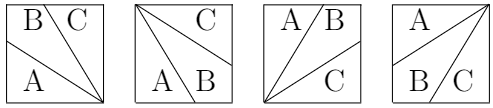
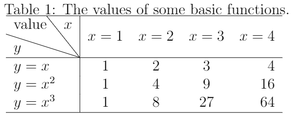
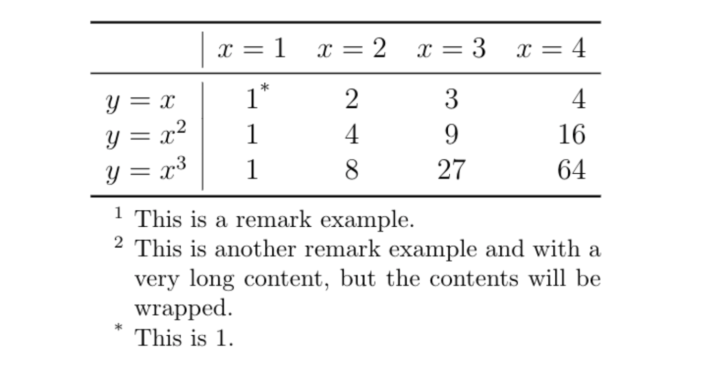

## 5.3 插入斜线与表注

### （1）插入斜线

在制作斜线表头或填充空白单元格时，经常需要用到斜线。在LaTeX中，我们可以通过调用`diagbox`宏包及其提供的`\diagbox[参数]{单元格内容1}...{单元格内容n}`命令将一个单元格划分为n个部分（即插入(n-1)条斜线），并且可以在`[]`中设置不同参数，从而对斜线宽度、高度、方向等属性进行调整，主要包括：

- `width`：设置斜线宽度；

- `height`：设置斜线高度；

- `font`：设置单元格字体大小和字体类型；

- `linewidth`：设置线宽；

- `linecolor`：设置线的颜色（需结合`xcolor`或其他宏包使用）；

- `dir`：设置斜线方向，包括NW（默认）、NE、SW和SE，分别表示西北方向、东北方向、西南方向、东南方向。当仅插入一个斜线时，`dir=NW`与`dir=SE`、`dir=NE`与`dir=SW`效果相同，分别表示插入反斜线和斜线；当插入两个斜线时，如`\diagbox[设置dir参数]{A}{B}{C}`，使用NW、NE、SW和SE的效果分别如图5.3.1所示：

<p align="center">

</p>

<center><b>图5.3.1</b> `\diagbox`命令中将方向参数设置为NW、NE、SW和SE的效果示意图</center>

【**例5-7**】使用`\usepackage{diagbox}`宏包中的`\diagbox`命令制作双斜线表头。

```tex
\documentclass[12pt]{article}
\usepackage{diagbox}
\begin{document}

\begin{table}[htbp] % 设置位置参数
    \centering
    \caption{The values of some basic functions.}
    \begin{tabular}{l|cccr}
        \hline
        \diagbox[width=5em]{$y$}{value}{$x$} & $x=1$ & $x=2$ & $x=3$ & $x=4$ \\
        \hline
        $y=x$ & 1 & 2 & 3 & 4 \\
        $y=x^{2}$ & 1 & 4 & 9 & 16 \\
        $y=x^{3}$ & 1 & 8 & 27 & 64 \\
        \hline
    \end{tabular}
    \label{table1}
\end{table}

\end{document}
```

编译上述代码，得到表格如图5.3.2所示。

<p align="center">

</p>

<center><b>图5.3.2</b> 编译后的文档内容</center>

### （2）插入表注

表格中的文本应当尽可能地保持简洁明了。因此，在保持简明的基础上，可以采用注释的方式以添加必要的细节对文本内容进行说明补充。通常，在以表格为载体的内容中，为了保持表格内容的完整性和独立性，我们往往不采用脚注\footnote{}的形式，而是将注释添加在表格底部（称之为表注）。在LaTeX中添加表注的方式有多种，其中比较常用的一种是使用`threeparttable`宏包及其相关命令，可以在表格底部生成与表格内容同宽的表注，并且当注释内容过长时可以实现自动换行，相比于其它方式更协调一致。

具体是在`tabular`环境外嵌套一层`threeparttable`环境，并在`tabular`环境之后将表注内容添加在`tablenotes`环境中，由此得到的表注将会显示在表格底部。如果需要将表格内容与表注建立关联关系，可以在表格内容的相应位置使用`\tnote{索引标记}`添加表注的索引标记，并且在`tablenotes`环境中使用`item[索引标记]`命令创建这项表注。

【**例5-8**】使用`threeparttable`宏包添加表注。

```tex
\documentclass[12pt]{article}
\usepackage{booktabs}
\usepackage{threeparttable}
\begin{document}

\begin{table}
    \centering
    \begin{threeparttable}
        \begin{tabular}{l|cccr}
            \toprule
            & $x=1$ & $x=2$ & $x=3$ & $x=4$ \\
            \midrule
            $y=x$ & 1\tnote{*} & 2 & 3 & 4 \\
            $y=x^{2}$ & 1 & 4 & 9 & 16 \\
            $y=x^{3}$ & 1 & 8 & 27 & 64 \\
            \bottomrule
        \end{tabular}
        \begin{tablenotes}
            \footnotesize
            \item[1] This is a remark example.
            \item[2] This is another remark example and with a very long content, but the contents will be wrapped.
            \item[*] This is 1.
        \end{tablenotes}
    \end{threeparttable}
\end{table}

\end{document}
```

编译上述代码，得到表格如图5.3.3所示。

<p align="center">

</p>

<center><b>图5.3.3</b> 编译后的文档内容</center>


【回放】[**5.2 合并单元格**](https://nbviewer.jupyter.org/github/xinychen/latex-cookbook/blob/main/chapter-5/section2.ipynb)

【继续】[**5.4 调整表格样式**](https://nbviewer.jupyter.org/github/xinychen/latex-cookbook/blob/main/chapter-5/section4.ipynb)

### License

<div class="alert alert-block alert-danger">
<b>This work is released under the MIT license.</b>
</div>
