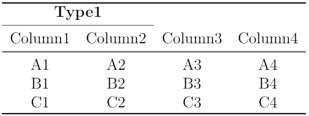

## 5.6 创建三线表格

`booktabs`宏包提供了更美观的行分隔线创建命令，常用于创建三线表格。其中，`\toprule`命令常用于创建表格顶线、`\bottomrule`命令常用于创建表格底线、`\midrule`命令常用于创建表格标题栏和表格内容的分隔线、以及`\cmidrule{起始列号-终止列号}`命令用于创建标题栏内部的分隔线并设置分隔线的跨越范围。

【**例5-23**】调用`booktabs`宏包及其相关命令创建三线表。

```tex
\documentclass[12pt]{article}
\usepackage{booktabs}
\usepackage{multirow}
\begin{document}

\begin{tabular}{cccc}
    \toprule
    \multicolumn{2}{c}{\textbf{Type1}} & \\
    \cmidrule{1-2}
    Column1 & Column2 & Column3 & Column4\\
    \midrule
    A1 & A2 & A3 & A4\\
    B1 & B2 & B3 & B4\\
    C1 & C2 & C3 & C4\\
    \bottomrule
\end{tabular}

\end{document}
```

编译上述代码，得到表格如图5.6.1所示。
<p align="center">

</p>

<center><b>图5.6.1</b> 编译后的文档内容</center>


【回放】[**5.5 创建彩色表格**](https://nbviewer.jupyter.org/github/xinychen/latex-cookbook/blob/main/chapter-5/section5.ipynb)

【继续】[**5.7 创建跨页表格**](https://nbviewer.jupyter.org/github/xinychen/latex-cookbook/blob/main/chapter-5/section7.ipynb)

### License

<div class="alert alert-block alert-danger">
<b>This work is released under the MIT license.</b>
</div>
