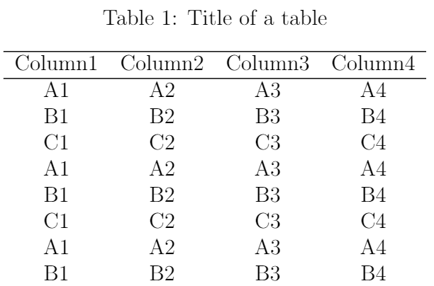
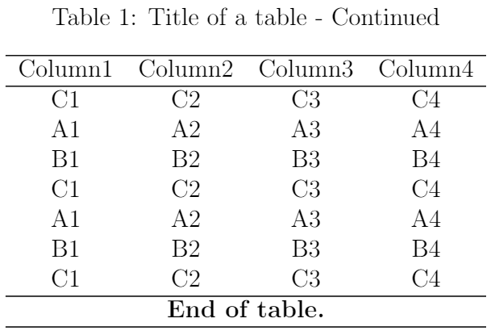

## 5.7 创建跨页表格

当表格太长时，使用`tabular`环境创建的表格会被裁剪掉页面放不下的部分。如果想让表格在行数太多时实现自动分页，可以通过调用`longtable`宏包并使用`longtable`环境创建表格。

在`longtable`环境中创建表格的方式与使用`table`和`tabular`嵌套环境类似，我们也能使用`\caption`、`\label`命令分别创建表格标题和索引标签。不同之处主要在于，`longtable`环境中可以设置跨页表格在每一页的重复表头和表尾，按照使用顺序，包括以下四个命令：

- `\endfirsthead`：`\begin{longtable}`和`\endfirsthead`之间的内容只会出现在表格第一页的表头部分；

- `\endhead`：`\endfirsthead`和`\endhead`之间的内容将会出现在表格除第一页之外的表头部分；

- `\endfoot`：`\endhead`和`\endfoot`之间的内容将会出现在除表格最后一页之外的表尾部分；

- `\endlastfoot`：`\endfoot`和`\endlastfoot`之间的内容只会出现在表格最后一页的表尾部分。

以上四个命令需要放置在`longtable`环境的开始处。

【**例5-24**】调用`longtable`宏包及环境创建跨页表格。

```tex
\documentclass[12pt]{article}
\usepackage{longtable}
\usepackage{multirow}
\begin{document}

\begin{longtable}[c]{cccc}
    % 创建表格第一页的表头部分
    \caption{Title of a table}\\
    \hline
    Column1 & Column2 & Column3 & Column4\\
    \hline
    \endfirsthead
    % 创建表格除第一页之外的表头部分
    \caption{Title of a table - Continued}\\
    \hline
    Column1 & Column2 & Column3 & Column4\\
    \hline
    \endhead
    % 创建表格除最后一页之外的表尾部分
    \hline
    \endfoot
    % 创建表格最后一页的表尾部分
    \multicolumn{4}{c}{\textbf{End of table.}}\\
    \hline
    \endlastfoot
    % 表格内容
    A1 & A2 & A3 & A4\\
    B1 & B2 & B3 & B4\\
    C1 & C2 & C3 & C4\\
    A1 & A2 & A3 & A4\\
    B1 & B2 & B3 & B4\\
    C1 & C2 & C3 & C4\\
    ... % 省略中间部分
    A1 & A2 & A3 & A4\\
    B1 & B2 & B3 & B4\\
    C1 & C2 & C3 & C4\\
    \hline
\end{longtable}

\end{document}
```

编译上述代码，得到表格如图5.7.1所示，其中左图和右图分别为表格第一页的部分内容以及第二页的所有内容。

<p align="center">
<table>
<tr>
<td></td>
<td></td>
</tr>
</table>
</p>

<center><b>图5.7.1</b> 编译后的文档内容</center>


【回放】[**5.6 创建三线表格**](https://nbviewer.jupyter.org/github/xinychen/latex-cookbook/blob/main/chapter-5/section6.ipynb)

【继续】[**5.8 旋转表格**](https://nbviewer.jupyter.org/github/xinychen/latex-cookbook/blob/main/chapter-5/section8.ipynb)

### License

<div class="alert alert-block alert-danger">
<b>This work is released under the MIT license.</b>
</div>
