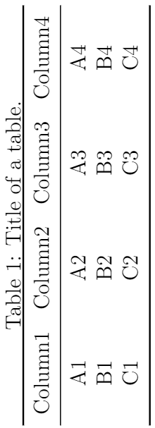

## 5.8 旋转表格

当表格列数太多时，横向表格的展现效果较差，这时需要将表格旋转90度，以纵向表格的形式展现。在LaTeX中可以通过调用`rotating`宏包，并使用`sidewaystable`环境取代`table`环境、嵌套`tabular`环境创建纵向表格（表格逆时针旋转90度）。

【**例5-25**】调用`rotating`宏包及`sidewaystable`环境创建纵向表格。

```tex
\documentclass[12pt]{article}
\usepackage{rotating}
\usepackage{booktabs}
\begin{document}

\begin{sidewaystable}[h]
\centering
    \caption{Title of a table.}
    \label{first label}
    \begin{tabular}{cccc}
        \toprule
        Column1 & Column2 & Column3 & Column4\\
        \midrule
        A1 & A2 & A3 & A4\\
        B1 & B2 & B3 & B4\\
        C1 & C2 & C3 & C4\\
        \bottomrule
    \end{tabular}
\end{sidewaystable}

\end{document}
```

编译上述代码，得到表格如图5.8.1所示。
<p align="center">

</p>

<center><b>图5.8.1</b> 编译后的文档内容</center>


【回放】[**5.7 创建跨页表格**](https://nbviewer.jupyter.org/github/xinychen/latex-cookbook/blob/main/chapter-5/section7.ipynb)

【继续】[**5.9 导入表格**](https://nbviewer.jupyter.org/github/xinychen/latex-cookbook/blob/main/chapter-5/section9.ipynb)

### License

<div class="alert alert-block alert-danger">
<b>This work is released under the MIT license.</b>
</div>
