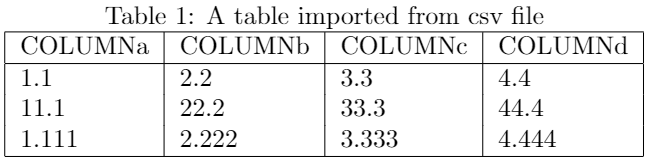
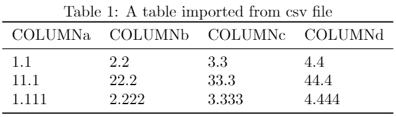
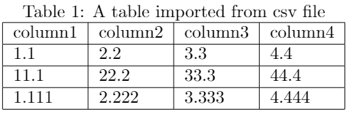
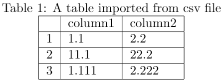

## 5.9 导入表格

一个表格有时候可能涉及大量数据，这时在LaTeX中手动输入数据并创建表格显然不够灵活，对此，可以通过导入csv文件数据的方式创建表格。LaTeX提供了`csvsimple`、`pgfplotstable`、`csvtools`等宏包可以帮助用户实现基于csv文件快速导入表格，其中，使用`csvsimple`宏包及其命令是一种比较常用的方式，我们下面将对其展开介绍。

### 5.9.1 快速创建表格

首先在导言区使用`\usepackage{csvsimple}`语句声明对`csvsimple`宏包的调用，然后在文档主体内容中使用`\csvautotabular{csv文件名或文件路径}`命令即可导入csv文件从而快速创建表格。作为导入数据的csv文件，既可以预先放在指定目录下，也可以在`filecontents`环境中创建，示例语句如下：

```tex
\begin{filecontents}{dataimport.csv}
COLUMNa,COLUMNb,COLUMNc,COLUMNd
1.1,2.2,3.3,4.4
11.1,22.2,33.3,44.4
1.111,2.222,3.333,4.444
\end{filecontents}
```

通过上述语句，创建了一个名为“dataimport.csv”的csv文件。

【**例5-26**】使用`filecontents`环境创建一个名为“dataimport.csv”的csv文件，并调用`csvsimple`宏包及`\csvautotabular`命令快速根据csv文件创建表格。

```tex
\begin{filecontents}{dataimport.csv}
COLUMNa,COLUMNb,COLUMNc,COLUMNd
1.1,2.2,3.3,4.4
11.1,22.2,33.3,44.4
1.111,2.222,3.333,4.444
\end{filecontents}

\documentclass{article}
\usepackage{csvsimple}
\begin{document}
\begin{table}
\centering
    \caption{A table imported from csv file}
    \label{labeloftable1}
    \csvautotabular{dataimport.csv}
\end{table}
\end{document}
```

编译上述代码，得到表格如图5.9.1所示。

<p align="center">

</p>

<center><b>图5.9.1</b> 编译后的文档内容</center>

### 5.9.2 创建三线表

也可以结合`booktabs`宏包，使用`\csvautobooktabular`命令自动读取csv文件并创建更专业的三线表格。

【**例5-27**】使用`filecontents`环境创建一个名为“dataimport.csv”的csv文件，并调用`csvsimple`和`booktabs`宏包，使用`\csvautobooktabular`命令快速根据csv文件创建三线表格。

```tex
\begin{filecontents}{dataimport.csv}
COLUMNa,COLUMNb,COLUMNc,COLUMNd
1.1,2.2,3.3,4.4
11.1,22.2,33.3,44.4
1.111,2.222,3.333,4.444
\end{filecontents}

\documentclass{article}
\usepackage{csvsimple}
\usepackage{booktabs}
\begin{document}
\begin{table}
\centering
    \caption{A table imported from csv file}
    \label{labeloftable1}
    \csvautobooktabular{dataimport.csv}
\end{table}
\end{document}
```

编译上述代码，得到表格如图5.9.2所示。

<p align="center">

</p>

<center><b>图5.9.2</b> 编译后的文档内容</center>

### 5.9.3 设置表格属性

如果想要调整导入的表格样式、表头、指定导入列等属性，可以使用`\csvreader[属性设置]{csv文件名或文件路径}{定义数据列名}{需要导入的数据列名}`命令读取csv文件创建表格，并通过设置属性选项、指定需要导入的数据列名从而调整表格属性。在属性设置选项中，主要包括以下属性：

- `tabular`：定义列类型。列类型个数应与需要导入的列数一致；

- `table head`：定义表头，包括标题行的顶线、列名、以及底线。由此可以对各列名进行重定义或省略；

- `late after line`：定义行分隔线。如，单行分隔线设置表示为`late after line=\\\hline`。

【**例5-28**】使用`csvreader`命令读取csv文件创建表格，并将表格列名从“COLUMNa,COLUMNb,COLUMNc,COLUMNd”重命名为“column1,column2,column3,column4”，并分别设置数据列名“ca,cb,cc,cd”用于指定导入哪些列。

```tex
\begin{filecontents*}{dataimport.csv}
COLUMNa,COLUMNb,COLUMNc,COLUMNd
1.1,2.2,3.3,4.4
11.1,22.2,33.3,44.4
1.111,2.222,3.333,4.444
\end{filecontents*}

\documentclass{article}
\usepackage{csvsimple}
\begin{document}
\begin{table}
\centering
    \caption{A table imported from csv file}
    \label{labeloftable1}
    \csvreader[tabular=|l|l|l|l|,
    table head=\hline column1 & column2 & column3 & column4\\\hline,
    late after line=\\\hline] % 表格属性设置
    {dataimport.csv} % csv文件名
    {COLUMNa =\ca, COLUMNb =\cb, COLUMNc =\cc, COLUMNd =\cd} % 定义数据列名
    {\ca & \cb & \cc & \cd} % 需要导入的数据列名
\end{table}
\end{document}
```

编译上述代码，得到表格如图5.9.3所示。

<p align="center">

</p>

<center><b>图5.9.3</b> 编译后的文档内容</center>

如果需要对导入的表格增加行标签列，那么在设置需要导入的数据列名时增加`\thecsvrow`命令即可。

【**例5-29**】使用`csvreader`命令读取csv文件创建表格，指定导入的数据列为前两列，并使用`\thecsvrow`命令增加行标签列。

```tex
\begin{filecontents}{dataimport.csv}
COLUMNa,COLUMNb,COLUMNc,COLUMNd
1.1,2.2,3.3,4.4
11.1,22.2,33.3,44.4
1.111,2.222,3.333,4.444
\end{filecontents}

\documentclass{article}
\usepackage{csvsimple}
\begin{document}
\begin{table}
\centering
    \caption{A table imported from csv file}
    \label{labeloftable1}
    \csvreader[tabular=|l|l|l|,
    table head=\hline & column1 & column2\\\hline,
    late after line=\\\hline] % 表格属性设置
    {dataimport.csv} % csv文件名
    {COLUMNa =\ca, COLUMNb =\cb, COLUMNc =\cc, COLUMNd =\cd} % 定义数据列名
    {\thecsvrow & \ca & \cb} % 需要导入的数据列名
\end{table}
\end{document}
```

编译上述代码，得到表格如图5.9.4所示。

<p align="center">

</p>

<center><b>图5.9.4</b> 编译后的文档内容</center>


【回放】[**5.8 旋转表格**](https://nbviewer.jupyter.org/github/xinychen/latex-cookbook/blob/main/chapter-5/section8.ipynb)

### License

<div class="alert alert-block alert-danger">
<b>This work is released under the MIT license.</b>
</div>
