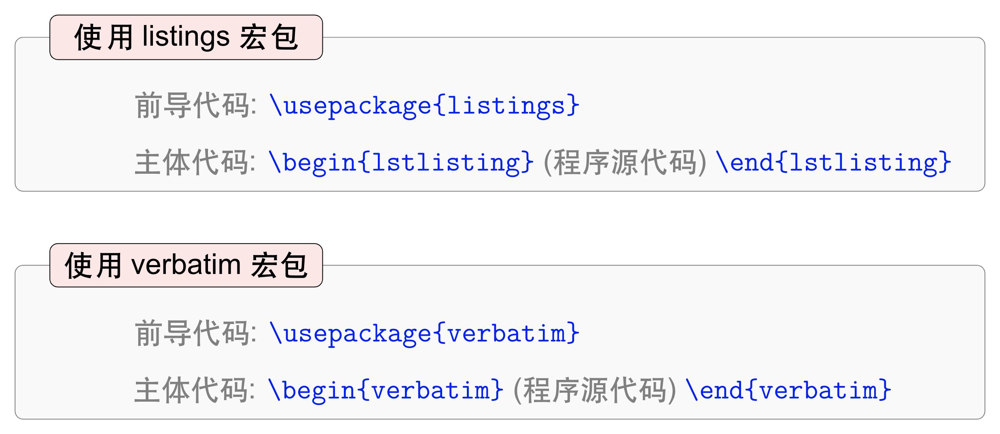

## 9.5 插入程序源代码

使用Beamer制作幻灯片时，可以使用`verbatim`宏包中的`\begin{verbatim} \end{verbatim}`环境插入程序源代码，相应地，`\begin{frame}[fragile] \end{frame}`环境中需要添加`fragile`选项，否则会导致编译报错。

<p align="center">

</p>

<center><b>图9.5.1</b> 在Beamer幻灯片中插入程序源代码的两种方式</center>

【**例9-45**】在`beamer`文档类型中使用`\begin{frame}[fragile] \end{frame}`和`\begin{verbatim} \end{verbatim}`环境插入几行简单的Python程序。

```tex
\documentclass{beamer}
\usefonttheme{professionalfonts}
\usepackage{verbatim}

\begin{document}

\begin{frame}[fragile]
\frametitle{Parent function}
\framesubtitle{A short list}

Please check out the following parent function list.
\begin{enumerate}
\item $y=x$
\item $y=|x|$
\item $y=x^{2}$
\item $y=x^{3}$
\item $y=x^{b}$
\end{enumerate}

\textbf{Python code:}

\begin{verbatim}
import numpy as np

b = 5
y = np.zeros(100)
for x in range(1, 101):
    y[x] = x ** b
\end{verbatim}

\end{frame}

\end{document}
```

编译上述代码，得到幻灯片如图9.5.2所示。

<p align="center">

</p>

<center><b>图9.5.2</b> 编译后的幻灯片效果</center>

除了`verbatim`宏包，还可以使用`listings`宏包中的`\begin{lstlistings} \end{lstlistings}`插入程序源代码。

【**例9-46**】在`beamer`文档类型中使用`\begin{frame}[fragile] \end{frame}`和`\begin{lstlistings} \end{lstlistings}`环境插入几行简单的Python程序。

```tex
\documentclass{beamer}
\usefonttheme{professionalfonts}
\usepackage{listings}

\begin{document}

\begin{frame}[fragile]
\frametitle{Parent function}
\framesubtitle{A short list}

Please check out the following parent function list.
\begin{enumerate}
\item $y=x$
\item $y=|x|$
\item $y=x^{2}$
\item $y=x^{3}$
\item $y=x^{b}$
\end{enumerate}

\textbf{Python code:}

\begin{lstlisting}
import numpy as np

b = 5
y = np.zeros(100)
for x in range(1, 101):
    y[x] = x ** b
\end{lstlisting}

\end{frame}

\end{document}
```

编译上述代码，得到幻灯片如图9.5.3所示。

<p align="center">

</p>

<center><b>图9.5.3</b> 编译后的幻灯片效果</center>

【回放】[**9.4 设置主题样式**](https://nbviewer.jupyter.org/github/xinychen/latex-cookbook/blob/main/chapter-9/section4.ipynb)

【继续】[**9.6 添加参考文献**](https://nbviewer.jupyter.org/github/xinychen/latex-cookbook/blob/main/chapter-9/section6.ipynb)

### License

<div class="alert alert-block alert-danger">
<b>This work is released under the MIT license.</b>
</div>
